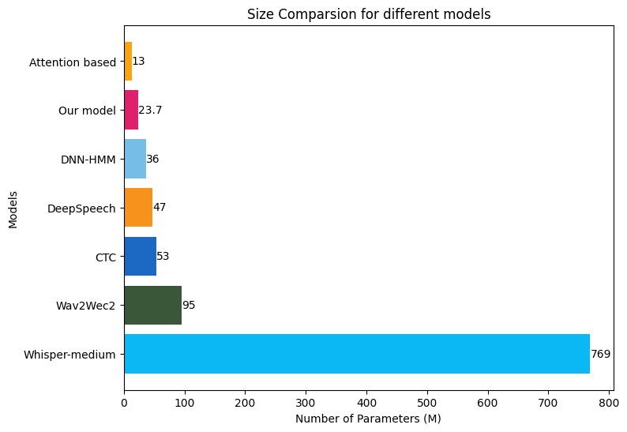
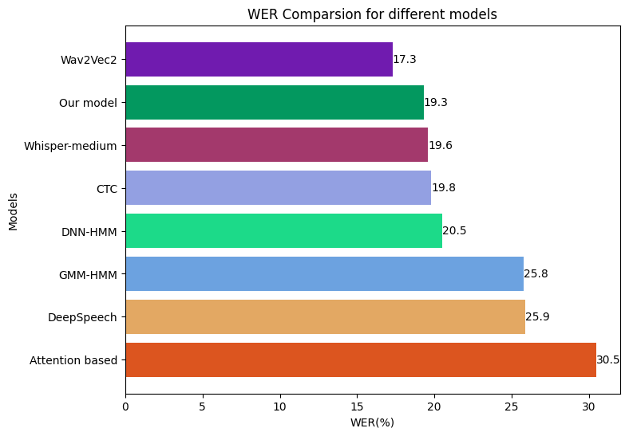

# SpeechToText

## Introduction

This project presents an in-depth exploration of speech-to-text models with a focus on minimizing space usage. By leveraging the LibriSpeech dataset, two distinct approaches for extracting text from speech are investigated and compared to existing models. The project aims to contribute to the field of speech recognition by providing insights into model performance and potential areas for improvement, while also addressing the important consideration of space optimization in various applications.

---

## Dataset Used
We use the Librispeech dataset  that is an open Corpus of audio and corresponding transcripts and has a collection of around 1000 hours of audiobooks as part of the LibriVox project.

**Dataset Link:** [https://www.openslr.org/12]\

---

## Models Used

### GMM-HMM
the GMM-HMM model is chosen due to its strengths in tackling temporal and acoustic variability in audio/speech data. Hidden Markov models are effective for this usecase because they can explicitly model after the temporal features of speech, capturing the sequential structure of phonemes.

### Residual CNN with Bidirectional GRU
The basic intuition behind choosing CNN combined with RNN stems from the spatially related local dependencies of features present in a spectrogram of an audio and the contextual nature of audio.

### Wav2Vec2
Wav2Vec2 is a self-supervised learning model for speech recognition developed by Facebook AI. Basically, Wav2Vec2 masks the speech input within the latent space and tackles a contrastive task that is established on a quantization of the latent representations. The latent representations are learned simultaneously.

### Whisper
Whisper leverages a transformer architecture for an end-to-end approach. It is designed to handle various speech processing tasks, including multilingual speech recognition, speech translation, spoken language identification and others

---

## Evaluation
We evaluate the performance of our model with other state-of-the-art speech to text models as illustrated below.

  
  

